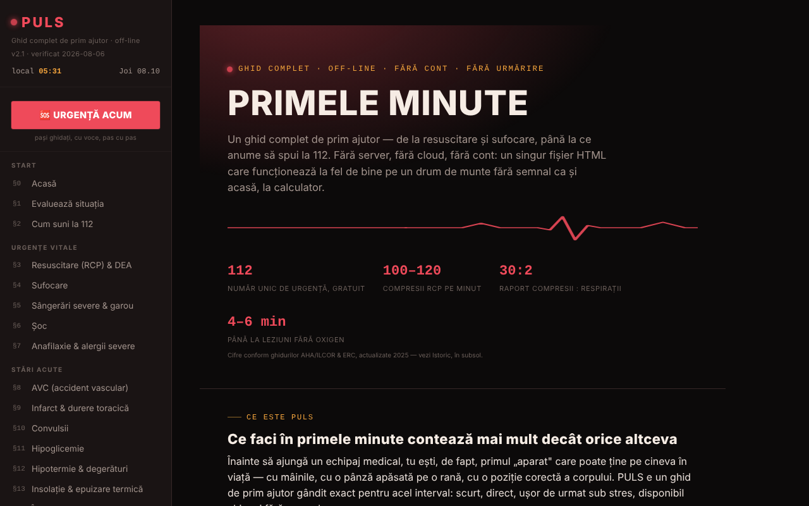

# PULS

Ghid complet de prim ajutor, într-un singur fișier HTML.

**Live:** https://chiuta.github.io/PULS/

## Ce este

PULS (v2.1 în aplicație, „verificat 2026-08-06”) este un ghid de prim ajutor în limba română, cu 32 de secțiuni și un „Mod Urgență” care te conduce pas cu pas, cu voce, prin manevre. Conținutul este declarat educațional, redat de autor pe baza ghidurilor ERC, AHA/ILCOR și OMS, **fără validare clinică de către un instructor sau medic autorizat**, și **nu înlocuiește** un curs autorizat, avizul medical sau intervenția profesională; în urgență reală se sună la 112.

## Funcții

- **Secțiuni (§0–§31):** evaluarea situației, cum suni la 112, RCP și DEA, sufocare, sângerări și garou, șoc, anafilaxie, AVC, infarct, convulsii, hipoglicemie, hipotermie, insolație, înec, intoxicații, arsuri, electrocutare, fracturi, traumatisme cranio-cerebrale, plăgi, traumatisme oculare, mușcături și înțepături, poziția de siguranță, trusa de prim ajutor, cardul meu de urgență, triaj, semnalizare de urgență, prim ajutor pediatric și psihologic, test de cunoștințe, glosar A–Z.
- **🆘 URGENȚĂ ACUM:** mod ghidat, cu pași și sinteză vocală (speechSynthesis din browser, acolo unde există).
- Metronom RCP cu sunet și vibrație, cronometru de rotație a salvatorilor, feedback de ritm din accelerometru, cronometru de garou.
- Cardul meu de urgență (grupă sanguină, alergii, afecțiuni, medicație, contact) cu export/import `.json` și generare de cod QR local; datele personalizează avertismentele din Mod Urgență.
- Triaj START cu listă de victime, semnalizare de urgență (sirenă, SOS Morse, strobe, bliț unde e suportat), activare Mod Urgență prin scuturarea telefonului (DeviceMotion).
- Butoane „Sună 112”, „Trimite locația mea” (geolocalizare + Web Share), „Cel mai apropiat spital”.
- Test de cunoștințe (până la zece întrebări pe rundă), tema Noapte/Zi, tipărirea secțiunii curente, buton „Raportează o eroare” (mailto).

## Manual de utilizare

1. Deschide pagina; navighează cu meniul din stânga (sau ☰ pe mobil).
2. Într-o urgență, apasă **🆘 URGENȚĂ ACUM**, alege situația și urmează pașii („Următorul pas →”, „← Înapoi”). Butonul „📞 SUNĂ 112 ACUM” inițiază apelul. `Esc` închide modul.
3. Pentru RCP, deschide §3 și pornește metronomul (sunet/vibrație); respectă indicațiile pe ecran.
4. În §2, „📍 Trimite locația mea” cere permisiunea de locație; „🏥 Cel mai apropiat spital” deschide harta telefonului.
5. Completează „Cardul meu de urgență” (§25) cât ești calm; „💾 Exportă (.json)” salvează cardul, „📂 Importă” îl restaurează, „▦ Generează cod QR” creează un cod citibil de orice cititor QR.
6. Schimbă tema cu „☾ Noapte” / „☀ Zi”; „🖨️ Printează secțiunea curentă” tipărește secțiunea.
7. Exersează cu §30 Test de cunoștințe; caută termeni în §31 Glosar.

## Confidențialitate și rețea

- **Stocare locală:** aplicația nu folosește `localStorage` / IndexedDB (nu există astfel de apeluri în cod). Cardul de urgență rămâne doar în memoria paginii; pentru a nu-l pierde la reîncărcare, exportă-l în fișier.
- **Rețea:** nu există `fetch` sau resurse încărcate de pe alte site-uri; biblioteca QR este inclusă în fișier. Singurele ieșiri din pagină sunt linkuri/acțiuni inițiate de utilizator: harta Google (`maps.google.com`, `google.com/maps`) pentru spital/farmacie și locația partajată, apelul `tel:112`, `mailto:`, plus linkuri către surse (crucearosie.ro, cpr.heart.org, erc.edu, who.int, smurd.ro, antisuicid.ro, patreon.com, trom.tf, chiuta.github.io).
- Aplicația declară: fără cookie-uri, fără analytics.

## Rulare locală / offline

Descarcă `index.html` și deschide-l în browser; ghidul funcționează fără internet. Doar butoanele de hartă/spital și partajarea locației au nevoie de conexiune și de aplicații ale dispozitivului.

## Licență

Licența nu este încă declarată explicit în acest repository; vezi nota din aplicație. Aplicația menționează doar că biblioteca de coduri QR inclusă (qrcode-generator, Kazuhiko Arase) este sub licență MIT.

## Audit

Audit: 2026-10-10 — verificat cu Playwright și axe-core (WCAG 2.1 AA, ambele teme); verificat în cod: fără `fetch`, fără `localStorage`. Corectate: meniul/layoutul pentru ecrane înguste (regulile CSS pentru ☰ lipseau), contrastul culorilor. Conținutul medical a fost doar parcurs, nu validat clinic — pentru verificare cere avizul unui specialist/instructor autorizat.

## Autor

Alexio — Alexandru-Ionuț Chiuță, contact: alexio@trom.tf

## English summary

PULS is a Romanian-language first-aid guide in a single HTML file: 32 sections, a voice-guided Emergency Mode, CPR metronome, tourniquet timer, emergency card with local QR code, START triage and emergency signalling. No localStorage and no fetch calls; map/hospital buttons open external services only on click. Educational content, not a substitute for certified training or calling the emergency number.
